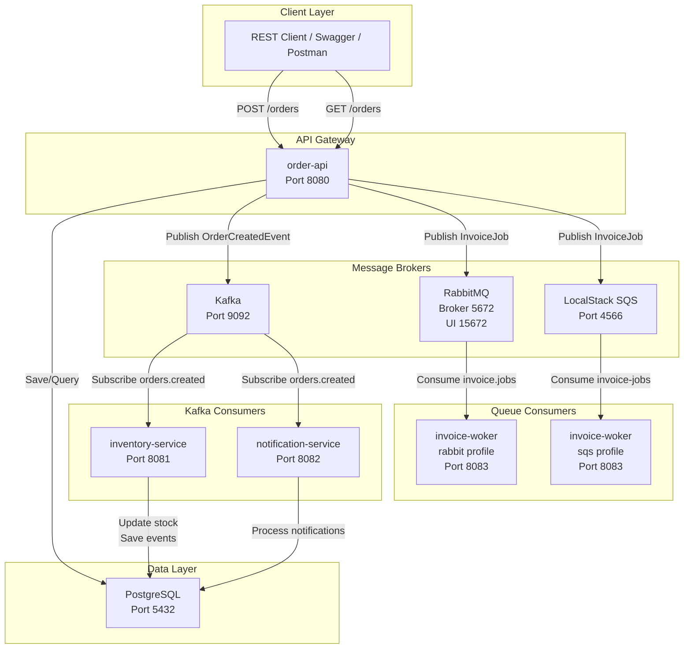
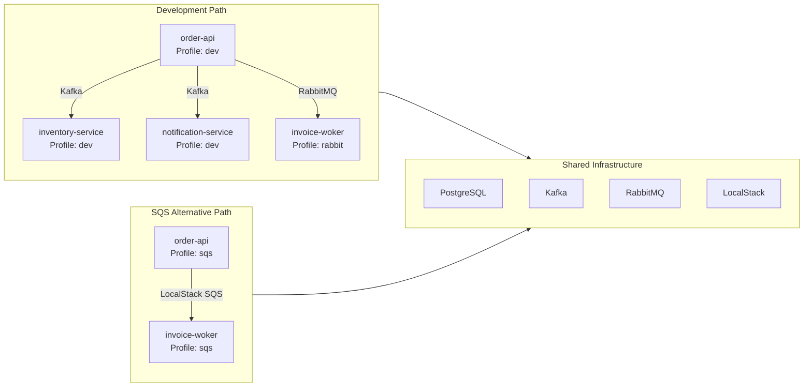
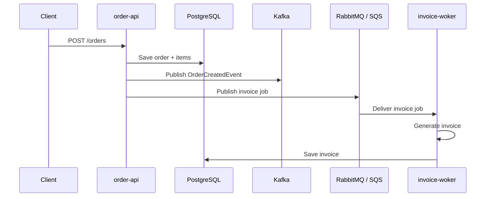
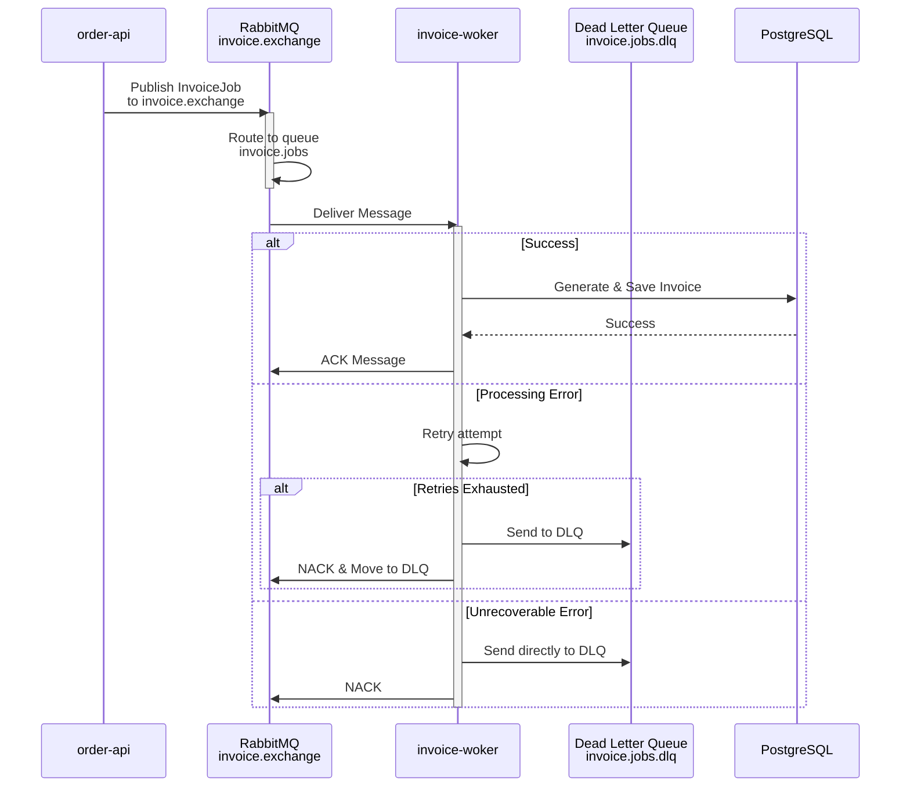
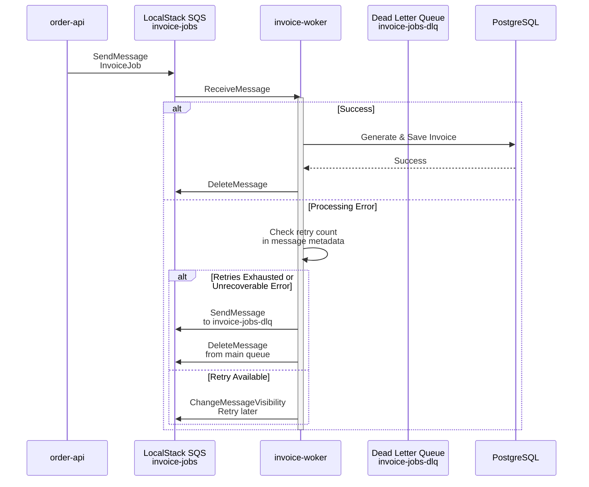
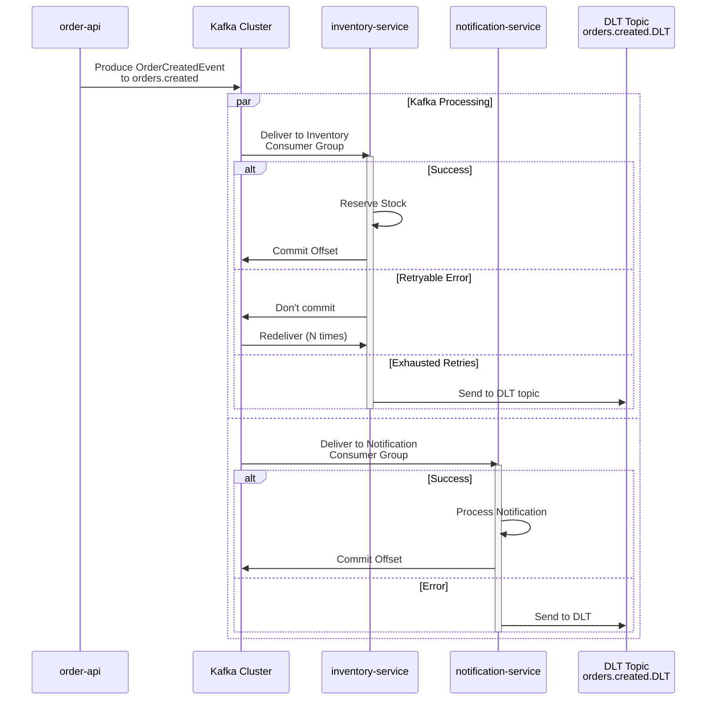
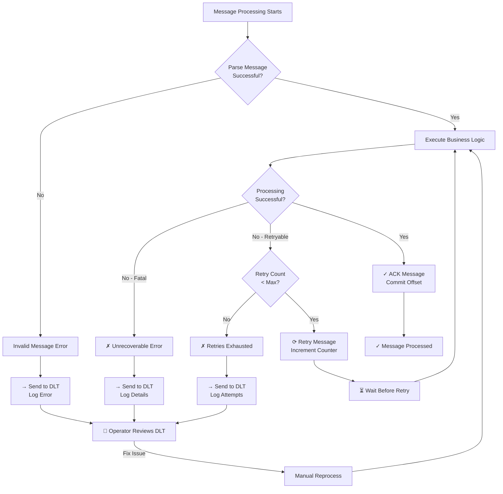

# 🏗️ Order Management Service

This is a Spring Boot order-processing platform with PostgreSQL, Kafka, RabbitMQ, AWS SQS via LocalStack, and multiple consumer services.

The repo is organized as a single root workspace with these services:
- 🔌 `order-api`
- 📦 `inventory-service`
- 🧾 `invoice-woker`
- 📬 `notification-service`

All services now share the package root `com.ordermanagement`.

---

## 🏛️ System Architecture



---

## 🔧 Services

### `order-api`
- REST API for creating and querying orders
- PostgreSQL persistence with Flyway migrations
- Kafka producer for order events
- RabbitMQ or SQS producer for invoice jobs
- Swagger/OpenAPI support

### `inventory-service`
- Kafka consumer for `OrderCreatedEvent`
- stock reservation and rejection handling
- idempotency with the `processed_events` table

### `invoice-woker`
- RabbitMQ consumer profile: `rabbit`
- SQS consumer profile: `sqs`
- invoice generation and DLQ handling

### `notification-service`
- Kafka consumer for order events
- separate consumer group for fan-out style processing

## Tech Stack

- Java 17
- Spring Boot 4
- Spring Web / Spring WebMVC
- Spring Data JPA
- Spring Kafka
- Spring AMQP
- Spring Cloud AWS 4
- PostgreSQL
- RabbitMQ
- AWS SQS via LocalStack
- Docker and Docker Compose
- JUnit 5, Mockito, Spring Boot Test

## Profiles

### `order-api`
- `dev`: PostgreSQL + Kafka + RabbitMQ
- `sqs`: PostgreSQL + Kafka + LocalStack SQS

### `invoice-woker`
- `rabbit`: RabbitMQ consumer
- `sqs`: SQS consumer

### `inventory-service`
- `dev`: Kafka + PostgreSQL

### `notification-service`
- `dev`: Kafka consumer

## Ports

- `order-api`: `8080`
- `inventory-service`: `8081`
- `notification-service`: `8082`
- `invoice-woker`: `8083`
- PostgreSQL: `5432`
- Kafka: `9092`
- RabbitMQ management UI: `15672`
- RabbitMQ broker: `5672`
- LocalStack edge: `4566`

## 🚀 Deployment Paths



## 📊 Message Flows

### Order Processing Flow (End-to-End)



### RabbitMQ Message Flow with DLT



### AWS SQS Message Flow with DLT



### Kafka Event Flow with Retry Topics & DLT



## 📬 Messaging Channels

- Kafka topics:
  - `orders.created`
  - `orders.rejected`
  - `orders.created.DLT`
- RabbitMQ:
  - exchange: `invoice.exchange`
  - queue: `invoice.jobs`
  - dead-letter queue: `invoice.jobs.dlq`
- SQS:
  - queue: `invoice-jobs`
  - dead-letter queue: `invoice-jobs-dlq`

### Error Handling & DLT Flow



## Services

### `order-api`
- REST API for creating and querying orders
- PostgreSQL persistence with Flyway migrations
- Kafka producer for order events
- RabbitMQ or SQS producer for invoice jobs
- Swagger/OpenAPI support

### `inventory-service`
- Kafka consumer for `OrderCreatedEvent`
- stock reservation and rejection handling
- idempotency with the `processed_events` table

### `invoice-woker`
- RabbitMQ consumer profile: `rabbit`
- SQS consumer profile: `sqs`
- invoice generation and DLQ handling

### `notification-service`
- Kafka consumer for order events
- separate consumer group for fan-out style processing

## Tech Stack

- Java 17
- Spring Boot 4
- Spring Web / Spring WebMVC
- Spring Data JPA
- Spring Kafka
- Spring AMQP
- Spring Cloud AWS 4
- PostgreSQL
- RabbitMQ
- AWS SQS via LocalStack
- Docker and Docker Compose
- JUnit 5, Mockito, Spring Boot Test

## Profiles

### `order-api`
- `dev`: PostgreSQL + Kafka + RabbitMQ
- `sqs`: PostgreSQL + Kafka + LocalStack SQS

### `invoice-woker`
- `rabbit`: RabbitMQ consumer
- `sqs`: SQS consumer

### `inventory-service`
- `dev`: Kafka + PostgreSQL

### `notification-service`
- `dev`: Kafka consumer

## Ports

- `order-api`: `8080`
- `inventory-service`: `8081`
- `notification-service`: `8082`
- `invoice-woker`: `8083`
- PostgreSQL: `5432`
- Kafka: `9092`
- RabbitMQ management UI: `15672`
- RabbitMQ broker: `5672`
- LocalStack edge: `4566`

## 🧪 Run with Make

The repo includes a root `Makefile` for common tasks.

Start infrastructure:

```bash
make up
```

Stop infrastructure:

```bash
make down
```

Restart infrastructure:

```bash
make restart
```

Run services:

```bash
make run-order-dev
make run-order-sqs
make run-inventory
make run-invoice-rabbit
make run-invoice-sqs
make run-notification
```

Run tests:

```bash
make test-order
make test-inventory
make test-invoice
make test-notification
```

Build modules:

```bash
make build-order
make build-inventory
make build-invoice
make build-notification
```

Show all targets:

```bash
make help
```

## 🖥️ Run Manually

If you prefer direct Maven commands, use these.

Start infrastructure:

```bash
docker compose up -d postgres kafka rabbitmq localstack
```

RabbitMQ path:

```bash
cd order-api && ./mvnw spring-boot:run -Dspring-boot.run.profiles=dev
cd ../invoice-woker && ./mvnw spring-boot:run -Dspring-boot.run.profiles=rabbit
cd ../inventory-service && ./mvnw spring-boot:run
cd ../notification-service && ./mvnw spring-boot:run
```

SQS path:

```bash
cd order-api && ./mvnw spring-boot:run -Dspring-boot.run.profiles=sqs
cd ../invoice-woker && ./mvnw spring-boot:run -Dspring-boot.run.profiles=sqs
```

## ✅ Testing

Run module tests from each service directory:

```bash
cd order-api && ./mvnw test
cd inventory-service && ./mvnw test
cd invoice-woker && ./mvnw test
cd notification-service && ./mvnw test
```

Useful checks:
- `order-api` tests cover order creation and publisher wiring
- `inventory-service` tests cover repository and idempotency behavior
- `invoice-woker` tests cover consumer startup and message handling
